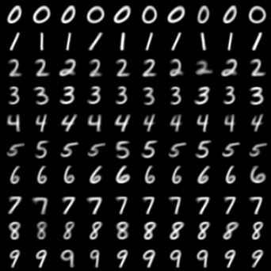

# SCGN: Spherical Chamfer Generative Networks

**A 1-Step, Non-Adversarial, Continuous Text-Conditional Generative Model based on Joint Hypersphere Topology.**



## Overview
Current generative models (GANs, Diffusion, Flow Matching) rely heavily on adversarial networks, computationally expensive multi-step ODE/SDE solvers, or discrete Optimal Transport algorithms (like Sinkhorn). 

**SCGN (Spherical Chamfer Generative Networks)** challenges this paradigm by introducing a purely geometric approach to generative modeling. It maps random noise directly to data in a **single forward pass**. 

It achieves continuous Text-to-Image conditional generation **WITHOUT**:
- Classification Loss
- Paired Reconstruction Loss (B2B matching)
- Discriminators
- Diffusion / ODE Solvers
- Explicit Optimal Transport (Sinkhorn/Hungarian)

## The Mathematical Breakthrough
When mapping noise to images using pure pixel-wise distance metrics (like MSE or Chamfer), networks traditionally collapse into producing "Gray Mush" (averaging the dataset) or experience severe Mode Collapse.

SCGN solves this through two topological constraints:

1. **The Spherical Manifold:** 
   By projecting both the generated images and the real images onto an $N$-dimensional hypersphere of radius $R = \sqrt{C \times H \times W}$, we prevent the network from collapsing into the mean (the origin). The network is forced to maintain high variance and contrast.

2. **Joint Space Continuous Chamfer Distance:**
   To induce semantic clustering without paired data, SCGN computes the distance matrix in a *Joint Space* consisting of the image pixels concatenated with a continuous condition embedding.
   
   $$ C_{ij} = (1 - \cos(\theta_{img})) + \gamma (1 - \cos(\theta_{cond})) $$

   By minimizing the bi-directional Chamfer distance (Min-Min Cosine Distance) over this joint space, the continuous neural network **spontaneously quantizes** its latent space. It learns to map specific continuous embeddings to highly specific macro-structures without explicit classification losses.

## Proving True Continuous Routing (Text Encoder Mode)
To prove that SCGN scales to true continuous Text-to-Image generation (where every prompt is unique and class size is 1), the model includes a `--mode text_encoder` option. 
In this mode, a 1-layer text encoder is trained jointly with the generator. Each image in the batch is assigned a unique prompt consisting of `[Class Token] + [Random Adjective Token]`. 
This guarantees that **every condition vector is unique**, proving SCGN can dynamically route continuous, infinite-dimensional text embeddings to visual structures without relying on discrete "class buckets".

## Usage
Train the unified SCGN model:

```bash
# Train on MNIST with simulated continuous CLIP embeddings
python train_scgn.py --dataset mnist --mode dummy

# Train on MNIST with a fully dynamic Text Encoder (Unique prompts per image)
python train_scgn.py --dataset mnist --mode text_encoder

# Train on Fashion-MNIST
python train_scgn.py --dataset fmnist

# Train on CIFAR-10
python train_scgn.py --dataset cifar
```

## How it works (The Code)
The core logic boils down to a few lines of PyTorch matrix multiplications:

```python
# Project generated and real to Joint Sphere
sim_img = torch.mm(gen_img_norm, real_img_norm.t())
sim_cond = torch.mm(gen_cond, real_cond.t())        

# Cost Matrix
C = (1.0 - sim_img) + gamma * (1.0 - sim_cond)

# Bidirectional Chamfer
loss_gen_to_real = C.min(dim=1)[0].mean()
loss_real_to_gen = C.min(dim=0)[0].mean()
loss = loss_gen_to_real + loss_real_to_gen
```

## Discovery
This architecture was discovered and mathematically formulated during a deep-dive research session into the limits of Optimal Transport, exploring how raw topological constraints can replace discriminators and ODE solvers.
